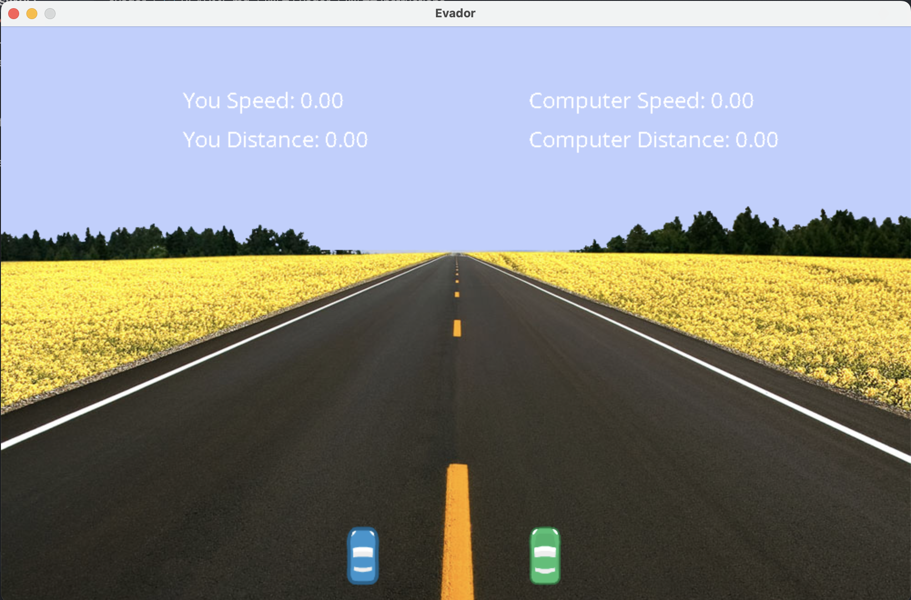
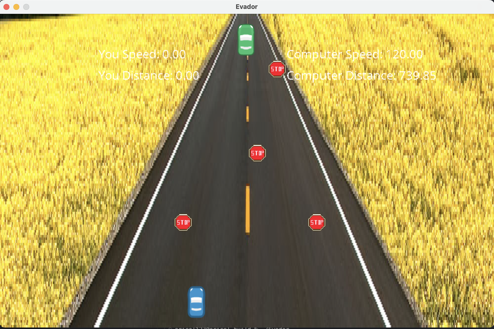

# Evador

This is a C++ desktop car game. 

There are two cars in the game, each representing a player. Car1 is the player(YOU) and car2 is an AI controlled car :).
The end game is to Evade obstacles as the car drives along the road. If player(YOU) car hits an obstacle, then game over

The AI car is programmed to be able to recognize obstacles and evade them. First person to the finish line wins.

USE WASD keyboard to move and drive car1.

## Build on top of SQL2 Game Engine
SQL2 is a popular game engine used for developing powerful C++ Games.

## Rubrics 
- The project demonstrates an understanding of C++ functions and control structures.
- The project accepts user input and processes the input.( player input using WASD keyboard)
- Object Oriented Programming Implemented. 3 classes:
  -- Game
  -- Car
  -- Obstacle
- Memory Management:
    -- C++ five rules of memory management used
    -- Smart Pointers are used for smart management of resources.
- Concurrency
    -- Two cars run on two different threads simultaneously
    -- Obstacles also utilizes threads(mutex)

## Instructions

1. Create build folder if not already `mkdir build`

2. cd to build folder `cd build`

3. Required Libraries:
     -- sudo apt-get install libsdl2-ttf-dev
     -- sudo apt install libsdl2-image-dev 
4. packaging with `cmake ..`

5. Build the project: `make`

6. Run the resulting executable: `./Evador`

7. Hit the ENTER Key to start playing or stop the game.
